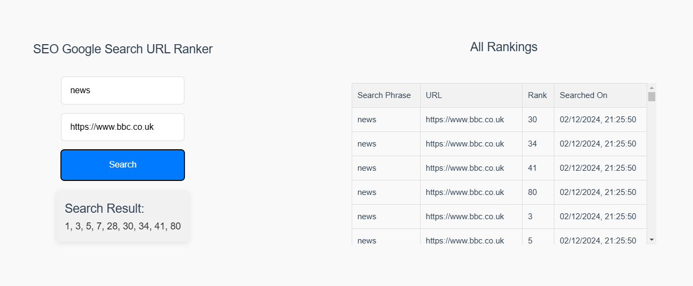

# SEO Ranker - Web Scraping & Ranking Application

## Description

This SEO Ranker Application is a web application designed to help users search for specific keywords and rank the results by scraping Google's search results. This project is built with a **C# API** for handling the back-end tasks, including web scraping and handling API requests, and a **Vue.js** front-end for interacting with the user.

This application allows users to enter a search phrase and a target URL to get search results directly from Google, and rank those results based on various criteria, such as relevance or URL ranking.

---

## Features

- **Search Keyword & URL**: Input a keyword and a target URL for SEO ranking.
- **Google Web Scraping**: Fetch and rank Google search results based on relevance and URL positioning.
- **Real-time Results**: Get real-time search result rankings from Google.

---

## Tech Stack

### Backend (API)

- **C#** with ASP.NET Core
- **HttpClient** for web scraping Google search results using Regex to identify search result links from anchor tags
- **ASP.NET Core Web API** for serving the API requests

### Frontend

- **Vue.js**
- **Axios** for HTTP requests
- **Vitest** for testing

---

## Installation

### Prerequisites

- [.NET SDK 8.0 or later](https://dotnet.microsoft.com/download/dotnet)
- [Node.js (v18.18.2 or later)](https://nodejs.org/en/download/)
- [Vue CLI](https://cli.vuejs.org/)
- [SQL Express](https://www.microsoft.com/en-gb/download/)

### Steps

#### 1. Clone the repository

Clone the repository to your local machine

#### 2. Set up the C# API

Navigate to the SEOApplicationAPI folder and run the following commands

```sh
dotnet restore

dotnet build

dotnet run
```

This will start the API on the default port (https://localhost:7222).

#### 3. Set up the Vue.js Frontend

Navigate to the SEOApplicationPortal folder and run the following command to install dependencies.

```sh
npm install
```

Start up the Application on **port 8080** to access the API.

```sh
npm run dev -- --port 8080
```

Run unit tests by running the following command.

```sh
npm run test:unit
```

### Database Setup

Install SQL Express and then run the following command from the SEOApplicationAPI solution directory.

Update the connection string in the appsettings.json file.

Run the following command to apply migrations:

```sh
dotnet ef database update --project ./SEOApplicationAPI.DataAccessLayer --startup-project ./SEOApplicationAPI
```

## API Endpoints

### `GET /api/Search`

**Description**: Scrapes the first 100 search results from Google based on the provided search phrase and returns the ranks of the target URL.

#### Query Parameters:

- `searchPhrase` (required): The search keyword/phrase to look up on Google.
- `targetUrl` (required): The URL that you want to check the ranking for.

#### Response:

A string containing a list of Google search result rankings for the target URL.

#### Example Response with Rankings:

```json
"1, 3, 5"
```

#### Examples Response with No Rankings:

```json
"0"
```

## UI Screenshot


